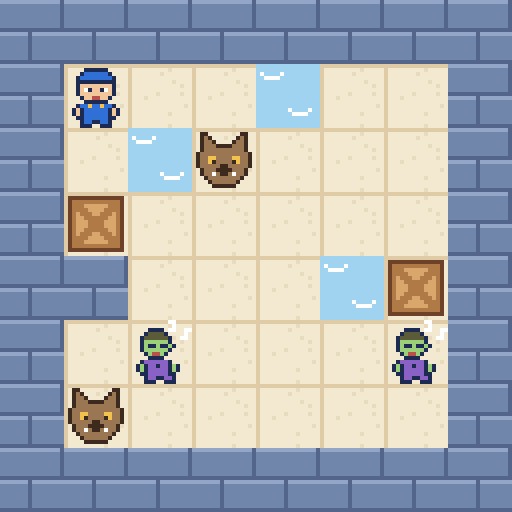

# Armas Insólitas

Es de noche y el almacén se ha llenado de zombis y hombres lobo. Para limpiarlo solo tienes tres armas muy poco
convencionales: una pistola-serpiente, una pistola de agua y un soplador de hojas (novedad de esta versión). Niveles
propios, cada uno con su mínimo demostrado con las reglas del propio juego. Juego web autónomo en **PuzzleScript Next**.

## Cómo se juega
- **Objetivo:** acabar con todos los monstruos y seguir vivo.
- **Flechas:** si no miras hacia ahí, te giras; si ya miras, avanzas. **X / espacio:** disparar. **Z:** deshacer · **R:** reiniciar.
- **Zombis:** duermen, pero si te pones a su lado te muerden. Saben nadar.
- **Hombres lobo:** ven en línea recta (también a través del agua), cargan hasta chocar y se comen lo que pillan; prefieren zombis y se ahogan en el agua.
- **Pistola-serpiente:** un disparo; la serpiente avanza recta comiéndose monstruos (¡y a ti!) y luego la diriges; su cuerpo es muro; el disparo te echa un paso atrás.
- **Pistola de agua:** cada disparo alarga el chorro; ahoga lobos (y a ti), hunde cajas y arrastra zombis.
- **Soplador:** sopla en línea recta y lo primero que encuentra se mueve una casilla.

## Niveles
1. Primer disparo: mínimo 12 pasos
2. Desde dónde disparar: mínimo 16 pasos
3. Lobos al acecho: mínimo 20 pasos
4. La gran serpiente: mínimo 31 pasos
5. Hombre al agua: mínimo 10 pasos
6. Caja a pique: mínimo 7 pasos
7. Chorro a chorro: mínimo 11 pasos
8. Marea alta: mínimo 20 pasos
9. Un soplido: mínimo 6 pasos
10. Escudo y cebo: mínimo 18 pasos
11. Viento a favor: mínimo 32 pasos
12. Huracán: mínimo 34 pasos

## Créditos
- Niveles, soplador, arte 16-bit y tarjetas: **Spider** (Fali + Claude), 2026
- Juego original: *Unconventional Guns*, de **rectangular Tim** (Ludum Dare 32, galería de PuzzleScript)
- Motor: [PuzzleScript Next](https://github.com/david-pfx/PuzzleScriptNext), incrustado en un único `index.html`
- Fuente del juego: [`juego.txt`](juego.txt)
